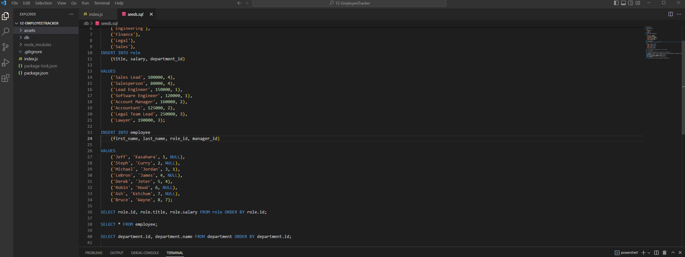

# EmployeeTracker

  
  
## Description
This is the 12th challenge for the UW Coding bootcamp. For this challenge, we had to create a command-line application using 
NodeJS that is capable of viewing and interacting with information in the SQL database. This application uses the ``Inquirer`` package for prompting the user 
as well as ``Console.table`` to print mySQL to the console.
  
## Table of Contents
* [Description](#description)
* [Installation](#installation)
* [Usage](#usage)
* [Questions](#questions)
  
## Installation
* ``git clone`` the repository
* Open a Node terminal and run the command ``npm install`` to install required packages
* Run the command ``node index.js`` to initiate the application
  
## Usage
Here is a screenshot of what it looks like

  
## Questions
Any Questions? Please reachout to me at jkasahara206@gmail.com
In addition, you can view this project and others on my [GitHub](https://github.com/CodeJeffK)
